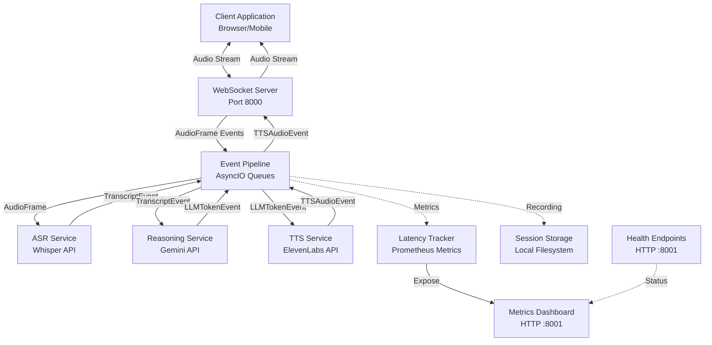
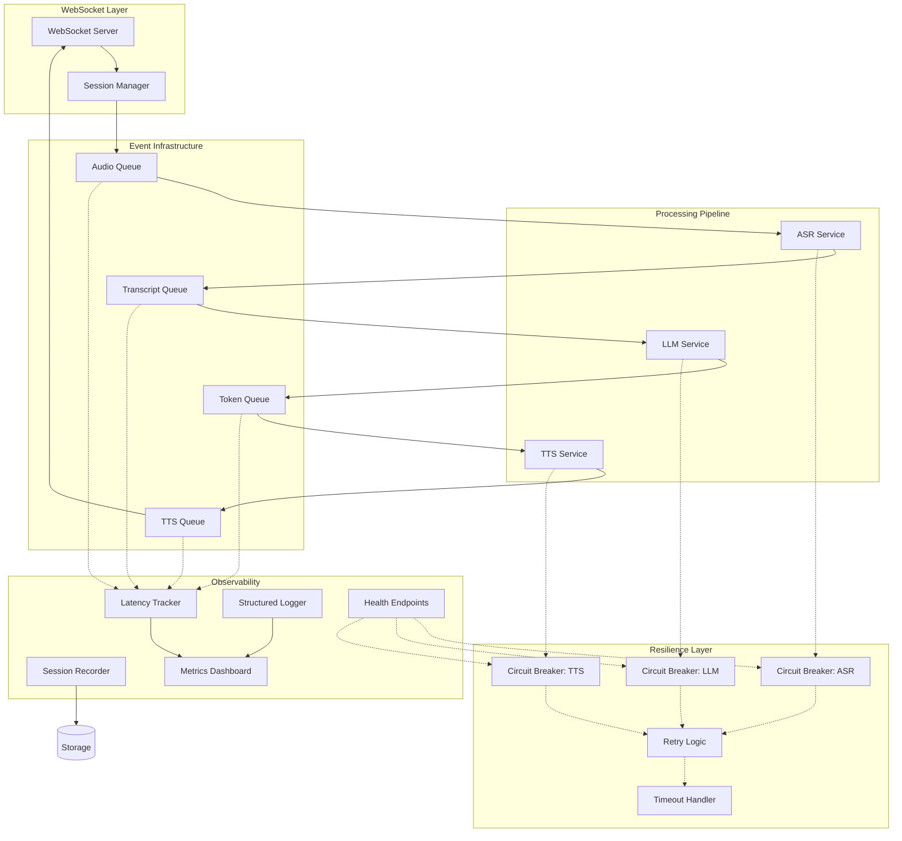
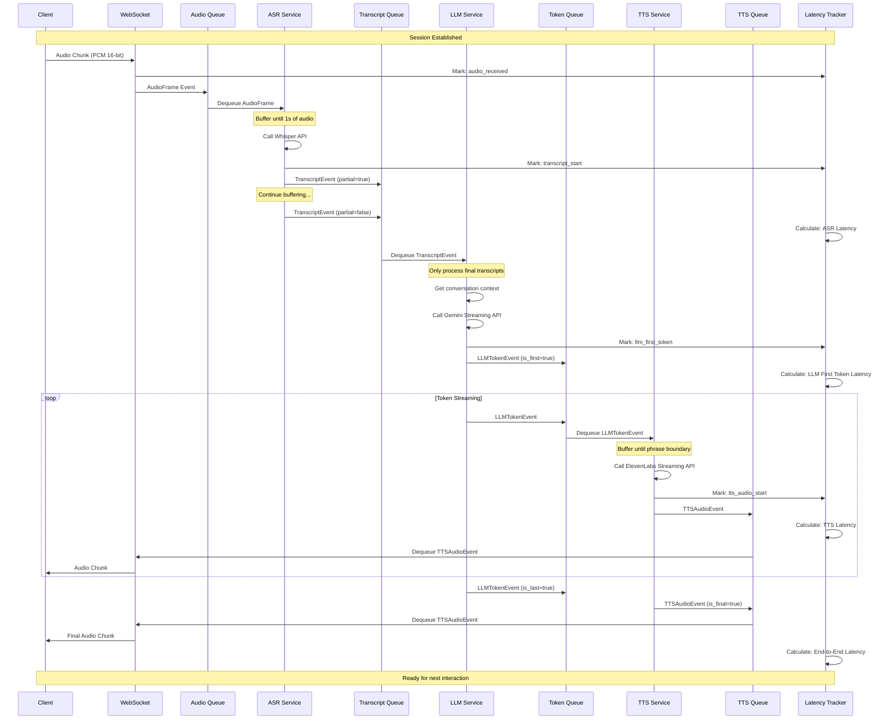
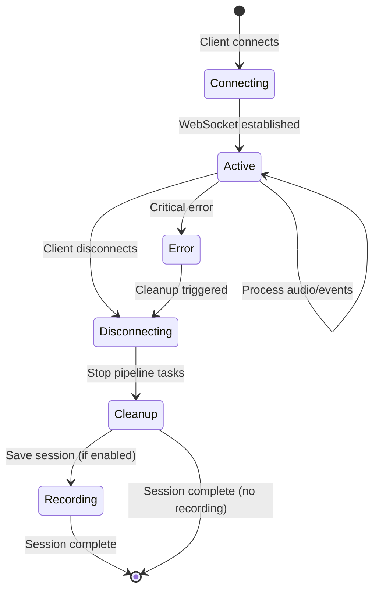
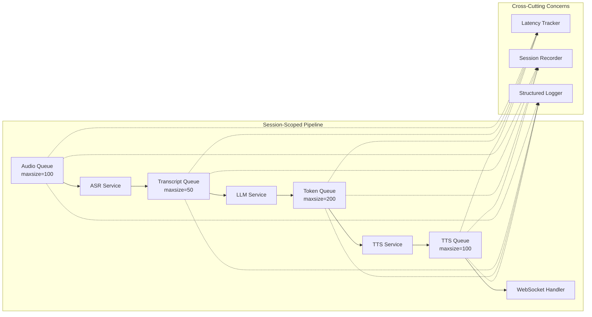
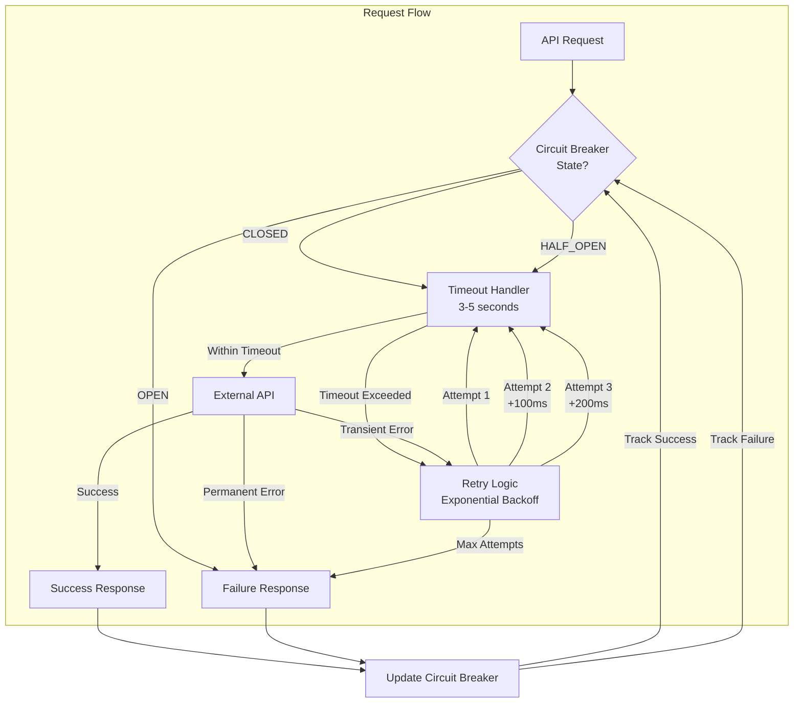
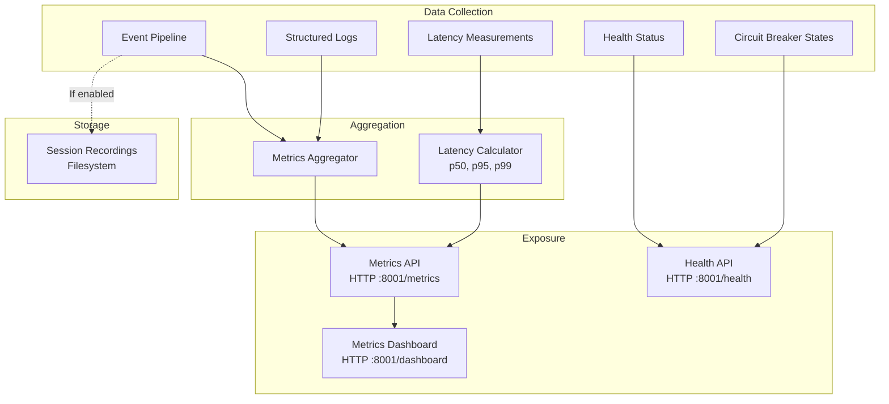
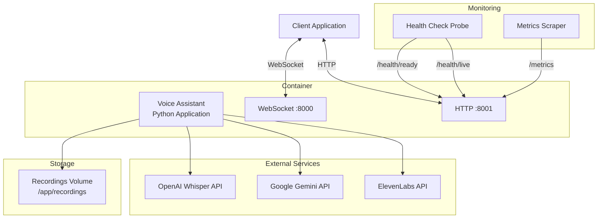
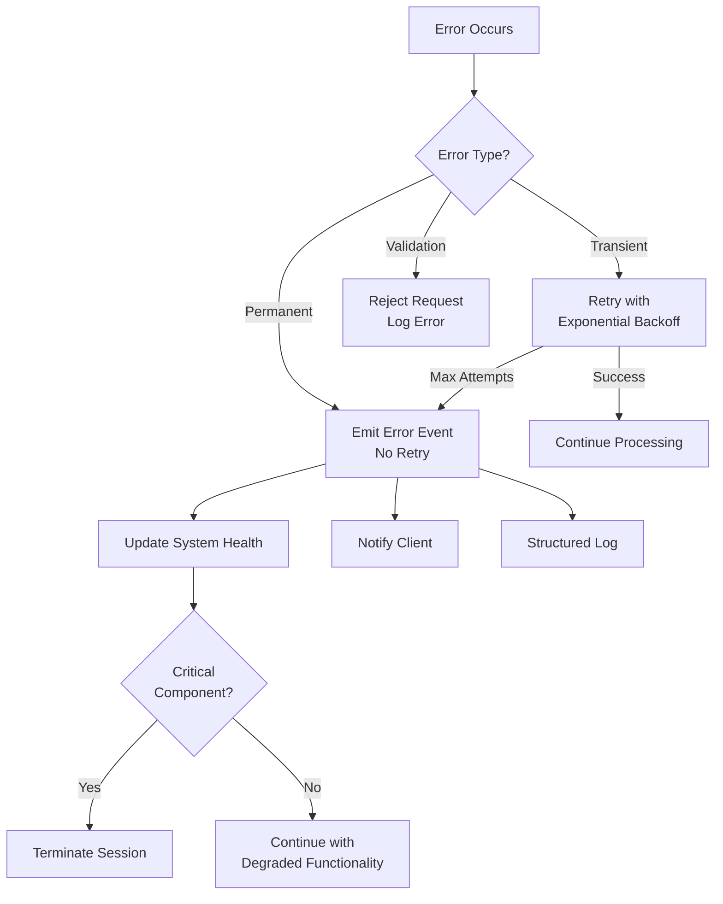

# System Architecture

## Overview

The Real-Time Voice Assistant is a production-ready streaming application that processes voice input through an asynchronous event pipeline. The system receives audio via WebSocket, transcribes it using Whisper ASR, generates responses using Gemini LLM, synthesizes speech using ElevenLabs TTS, and streams audio back to the client—all with comprehensive latency tracking and fault tolerance.

### Design Principles

1. **Streaming-First Architecture**: Every component operates on streaming data with minimal buffering
2. **Async/Await Throughout**: Non-blocking I/O using Python's asyncio for high concurrency
3. **Event-Driven Pipeline**: Loosely coupled components communicating via typed events
4. **Observable by Default**: Comprehensive instrumentation for latency, errors, and state transitions
5. **Resilient by Design**: Timeouts, retries, circuit breakers, and graceful degradation
6. **Debuggable**: Session recording and replay for post-mortem analysis

### Architecture Goals

- **Low Latency**: End-to-end latency under 2 seconds for typical interactions
- **High Throughput**: Support 100+ concurrent voice sessions on modest hardware
- **Fault Tolerance**: Isolate failures, retry transient errors, prevent cascading failures
- **Observability**: Track every millisecond through the pipeline with structured logging
- **Maintainability**: Modular design with clear interfaces and dependency injection

## System Context Diagram



## Component Architecture

### Core Components



### Component Responsibilities

| Component | Responsibilities | Key Technologies |
|-----------|-----------------|------------------|
| **WebSocket Server** | Accept connections, manage session lifecycle, stream audio bidirectionally | websockets, asyncio |
| **Session Manager** | Create/cleanup sessions, initialize pipeline queues, manage session state | asyncio.Queue |
| **ASR Service** | Buffer audio, transcribe via Whisper API, emit transcript events | OpenAI Whisper API |
| **LLM Service** | Maintain conversation context, stream tokens from Gemini, emit token events | Google Gemini API |
| **TTS Service** | Buffer tokens, synthesize via ElevenLabs, emit audio events | ElevenLabs API |
| **Circuit Breakers** | Prevent cascading failures, implement open/half-open/closed states | Custom implementation |
| **Retry Logic** | Exponential backoff for transient failures | Custom decorator |
| **Latency Tracker** | Measure pipeline stage latencies, calculate percentiles | In-memory metrics |
| **Metrics Dashboard** | Expose metrics via HTTP, serve visualization dashboard | aiohttp |
| **Health Endpoints** | Provide /health, /health/ready, /health/live endpoints | aiohttp |
| **Session Recorder** | Record audio and events for debugging | gzip, JSON |
| **Structured Logger** | Emit JSON logs with session context | Python logging |

## Audio-to-Audio Flow Sequence

This diagram shows the complete flow from receiving audio to sending synthesized speech back to the client.



## Session Lifecycle



### Session Lifecycle Details

1. **Connecting**: Client initiates WebSocket connection
   - Server accepts connection
   - Generates unique session ID
   - Creates Session object

2. **Active**: Session is processing audio
   - Initialize event queues (audio, transcript, token, TTS)
   - Start pipeline tasks (ASR, LLM, TTS)
   - Initialize latency tracker
   - Initialize session recorder (if enabled)
   - Process audio frames and events

3. **Disconnecting**: Client disconnects or error occurs
   - Stop accepting new audio
   - Allow in-flight events to complete (with timeout)
   - Cancel pipeline tasks

4. **Cleanup**: Release resources
   - Close event queues
   - Cancel asyncio tasks
   - Clear conversation context
   - Finalize latency measurements

5. **Recording**: Save session data (if enabled)
   - Persist audio frames
   - Persist all events
   - Save metadata (duration, event counts, errors)

## Event Pipeline Architecture

The event pipeline is the core of the system, connecting all processing components through asyncio queues. For detailed information about the event pipeline, see [Event Pipeline Architecture](event_pipeline_architecture.md).

### Event Flow



### Event Types

All events are Python dataclasses with timestamp metadata:

- **AudioFrame**: Raw audio data chunk (PCM 16-bit, 16kHz mono)
- **TranscriptEvent**: Speech recognition result (partial or final)
- **LLMTokenEvent**: Streaming token from language model
- **TTSAudioEvent**: Synthesized audio chunk
- **ErrorEvent**: Error notification with retry information

See [API Documentation](api.md) for complete event schemas.

## Resilience Architecture

The system implements multiple layers of resilience to handle failures gracefully.



### Resilience Patterns

1. **Timeouts**: All external API calls have configurable timeouts
   - ASR (Whisper): 3 seconds
   - LLM (Gemini): 5 seconds
   - TTS (ElevenLabs): 3 seconds

2. **Retries with Exponential Backoff**:
   - Initial delay: 100ms
   - Backoff multiplier: 2x
   - Max attempts: 3
   - Only for retryable errors (network, timeout)

3. **Circuit Breakers**:
   - Failure threshold: 50% over 10 requests
   - Open timeout: 30 seconds
   - States: CLOSED → OPEN → HALF_OPEN → CLOSED/OPEN

4. **Graceful Degradation**:
   - Non-critical component failures don't stop audio processing
   - System continues with reduced functionality
   - Health status reflects degraded state

For detailed information, see [Resilience Patterns](resilience_patterns.md).

## Observability Architecture



### Latency Tracking

The system tracks latency at every pipeline stage:

| Metric | Description | Budget |
|--------|-------------|--------|
| **ASR Latency** | Audio receipt → Transcript emission | 500ms |
| **LLM First Token** | Transcript receipt → First token emission | 300ms |
| **LLM Generation** | First token → Last token | Variable |
| **TTS Latency** | Token receipt → Audio emission | 400ms |
| **End-to-End** | Audio input → Audio output | 2000ms |
| **WebSocket Send** | Event → Network transmission | Variable |

Statistics calculated: count, mean, median, p95, p99, min, max

For detailed information, see [Metrics Dashboard](metrics_dashboard.md).

## Deployment Architecture



### Container Configuration

- **Base Image**: python:3.11-slim
- **Exposed Ports**:
  - 8000: WebSocket server
  - 8001: Metrics and health endpoints
- **Volumes**:
  - /app/recordings: Session recordings (if enabled)
- **Health Checks**:
  - Liveness: /health/live (every 30s)
  - Readiness: /health/ready (every 30s)
- **Environment Variables**: See [Configuration](configuration.md)

For deployment instructions, see [Running the Application](running_the_application.md).

## Data Flow Patterns

### Streaming Pattern

All components use streaming to minimize latency:

```
Audio Stream → ASR → Partial Transcripts → LLM → Token Stream → TTS → Audio Stream
```

- **No waiting for complete input**: ASR emits partial transcripts
- **No waiting for complete response**: LLM streams tokens as generated
- **No waiting for complete synthesis**: TTS emits audio chunks as synthesized

### Buffering Strategy

Strategic buffering balances latency and quality:

| Component | Buffer Size | Rationale |
|-----------|-------------|-----------|
| **ASR** | 1 second | Minimum audio for accurate transcription |
| **LLM** | No buffer | Stream tokens immediately |
| **TTS** | 10 tokens or sentence boundary | Minimum text for natural synthesis |

### Backpressure Handling

Queue sizes enforce backpressure:

- **Producer faster than consumer**: Queue fills, producer blocks
- **Consumer faster than producer**: Queue empties, consumer waits
- **Balanced throughput**: Queue maintains steady state

## Error Handling Strategy



### Error Classification

- **Transient Errors**: Network timeouts, temporary API unavailability → Retry
- **Permanent Errors**: Authentication failures, invalid input → No retry
- **Validation Errors**: Malformed data, protocol violations → Reject
- **Component Failures**: Service crashes, resource exhaustion → Isolate

## Security Considerations

### API Key Management

- API keys loaded from environment variables
- Never logged or exposed in responses
- Validated at startup

### Input Validation

- Audio data validated for format and size
- WebSocket messages validated against protocol
- Configuration values validated at startup

### Network Security

- WebSocket connections can be secured with TLS (wss://)
- Health endpoints can be restricted by network policy
- No authentication implemented (add as needed)

### Resource Limits

- Queue sizes prevent unbounded memory growth
- Timeouts prevent resource exhaustion
- Session cleanup ensures resource release

## Performance Characteristics

### Latency Profile

Typical latency breakdown for a voice interaction:

| Stage | Typical | p95 | p99 |
|-------|---------|-----|-----|
| ASR | 300ms | 450ms | 500ms |
| LLM First Token | 200ms | 280ms | 300ms |
| TTS | 250ms | 350ms | 400ms |
| **Total** | **750ms** | **1080ms** | **1200ms** |

### Throughput

- **Concurrent Sessions**: 100+ on modest hardware (4 CPU, 8GB RAM)
- **Audio Processing**: Real-time (1x speed)
- **Token Streaming**: 50-100 tokens/second per session

### Resource Usage

Per session:
- **Memory**: ~10MB (queues, buffers, context)
- **CPU**: Minimal (I/O bound, async)
- **Network**: ~32 kbps audio + API calls

## Related Documentation

- [Event Pipeline Architecture](event_pipeline_architecture.md) - Detailed event pipeline design
- [API Documentation](api.md) - Complete API reference
- [Configuration](configuration.md) - Configuration options
- [Resilience Patterns](resilience_patterns.md) - Fault tolerance implementation
- [Session Management](session_management.md) - Session lifecycle details
- [WebSocket Server](websocket_server.md) - WebSocket protocol
- [ASR Service](asr_service.md) - Speech recognition details
- [Reasoning Service](reasoning_service.md) - LLM integration
- [TTS Service](tts_service.md) - Speech synthesis
- [Metrics Dashboard](metrics_dashboard.md) - Observability
- [Health System](health_system.md) - Health checks
- [Session Recording](session_recording.md) - Recording and replay
- [Running the Application](running_the_application.md) - Deployment guide
